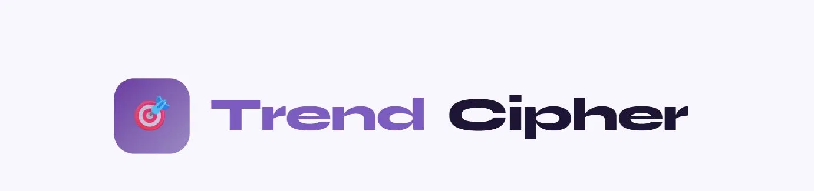
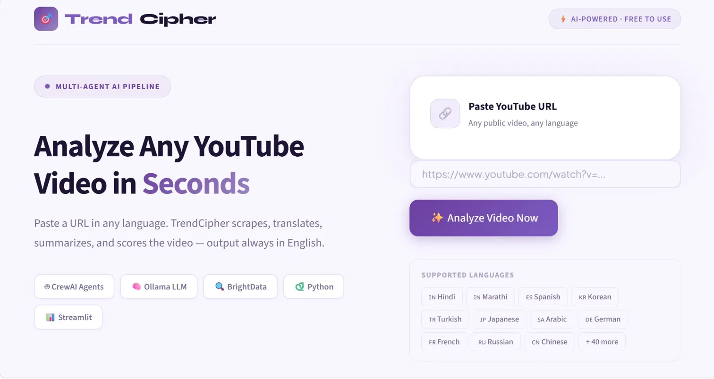
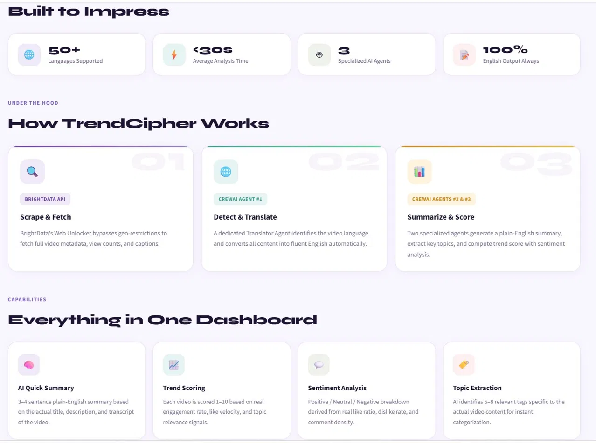

<div align="center">




### AI-Powered YouTube Trend Analysis — Any Language, Always English

[](https://streamlit.io)
[](https://python.org)
[](https://crewai.com)
[](https://developers.google.com/youtube)

</div>

---

## 🎯 What is TrendCipher?

**TrendCipher** is an end-to-end AI-powered YouTube video analysis platform. Paste any YouTube URL — in Hindi, Marathi, Korean, Spanish, Turkish, Arabic, or 50+ other languages — and TrendCipher instantly delivers a structured English summary, engagement metrics, sentiment breakdown, trend score, and key topic extraction.

Built using a multi-agent AI pipeline with **CrewAI**, **Ollama (LLaMA 3)**, **BrightData**, and **Streamlit**.

---

## 📸 Screenshots

### Landing Page


### Analysis Dashboard


---

## ✨ Features

| Feature | Description |
|---|---|
| 🌐 **50+ Languages** | Paste videos in any language — output is always English |
| 🧠 **AI Quick Summary** | 3–4 sentence plain-English summary from actual video content |
| 📈 **Trend Scoring** | 1–10 score based on real engagement rate and topic signals |
| 🎭 **Sentiment Analysis** | Positive / Neutral / Negative derived from real YouTube stats |
| 🏷️ **Topic Extraction** | 5–8 relevant tags extracted by AI from actual video content |
| 📊 **Engagement Dashboard** | Views, likes, comments, dislikes, like/view ratio |
| 🔍 **BrightData Scraper** | Bypasses geo-restrictions to fetch real metadata |
| 🤖 **3 Specialized AI Agents** | Translator → Summarizer → Analyst pipeline |

---

## 🏗️ System Architecture

```
YouTube URL (any language)
        │
        ▼
┌─────────────────────┐
│   BrightData        │  ← Scrapes title, description,
│   Web Unlocker      │    stats, captions
└────────┬────────────┘
         │
         ▼
┌─────────────────────┐
│  youtube-transcript │  ← Fetches raw transcript
│  -api               │    in original language
└────────┬────────────┘
         │
         ▼
┌─────────────────────┐
│  CrewAI Agent #1    │  ← Detects language
│  Translator         │    Translates → English
└────────┬────────────┘
         │
         ▼
┌─────────────────────┐
│  CrewAI Agent #2    │  ← Reads English content
│  Summarizer         │    Writes 3–4 sentence summary
└────────┬────────────┘
         │
         ▼
┌─────────────────────┐
│  CrewAI Agent #3    │  ← Extracts topics
│  Analyst            │    Scores trend (1–10)
│                     │    Estimates sentiment
└────────┬────────────┘
         │
         ▼
┌─────────────────────┐
│  Streamlit          │  ← Beautiful lavender dashboard
│  Dashboard          │    Charts, metrics, insights
└─────────────────────┘
```

---

## 🗂️ Project Structure

```
trendcipher/
├── app.py                    # Streamlit UI — entry point
├── crew/
│   ├── agents.py             # CrewAI agent definitions
│   ├── tasks.py              # CrewAI task prompts
│   └── crew.py               # Pipeline orchestrator & metrics engine
├── scraper/
│   └── brightdata.py         # BrightData + YouTube API scraper
├── utils/
│   └── parser.py             # URL validation utility
├── .streamlit/
│   ├── config.toml           # Streamlit theme config
│   └── secrets.toml          # API keys (not committed to GitHub)
├── assets/                   # Screenshots for README
├── .env.example              # Environment variable template
├── .gitignore
├── requirements.txt
└── README.md
```

---

## 🛠️ Tech Stack

| Layer | Technology |
|---|---|
| **Frontend** | Streamlit (Python) |
| **AI Agents** | CrewAI v1.14+ |
| **LLM** | Ollama — LLaMA 3.2 (local) |
| **Scraping** | BrightData Web Unlocker |
| **YouTube Data** | YouTube Data API v3 |
| **Transcripts** | youtube-transcript-api |
| **Charts** | Streamlit native (area + bar) |
| **Deployment** | Streamlit Cloud |

---

## ⚙️ Local Setup

### Prerequisites
- Python 3.11+
- Git
- Ollama installed → [ollama.com/download](https://ollama.com/download)

### 1. Clone the repository
```bash
git clone https://github.com/kanupriyaprachande/trendcipher.git
cd trendcipher
```

### 2. Create virtual environment
```bash
# Windows
python -m venv venv
venv\Scripts\activate

# Mac/Linux
python3 -m venv venv
source venv/bin/activate
```

### 3. Install dependencies
```bash
pip install -r requirements.txt
```

### 4. Pull the AI model
```bash
ollama pull llama3.2:1b
```

### 5. Configure environment
Create a `.env` file in the project root:
```env
YOUTUBE_API_KEY=your_youtube_api_key_here
BRIGHTDATA_USER=your_brightdata_username
BRIGHTDATA_PASS=your_brightdata_password
OLLAMA_MODEL=llama3.2:1b
```

### 6. Run the app
```bash
streamlit run app.py
```

Open **http://localhost:8501** in your browser.

---

## 🔑 API Keys Required

### YouTube Data API v3 (Free)
1. Go to [console.cloud.google.com](https://console.cloud.google.com)
2. Create a new project → Enable **YouTube Data API v3**
3. Go to Credentials → Create API Key
4. Restrict to YouTube Data API v3

### BrightData (Free Trial Available)
1. Sign up at [brightdata.com](https://brightdata.com)
2. Go to Proxies → Web Unlocker → Create Zone
3. Copy username and password

---

## 🚀 Deployment

This project is deployed on **Streamlit Cloud** (free tier).

### Deploy your own instance:
1. Fork this repository
2. Go to [share.streamlit.io](https://share.streamlit.io)
3. Connect your GitHub repo
4. Set **Main file path** → `app.py`
5. Under **Advanced settings → Secrets**, add:
```toml
YOUTUBE_API_KEY = "your_key"
BRIGHTDATA_USER = "your_user"
BRIGHTDATA_PASS = "your_pass"
OLLAMA_MODEL    = "llama3.2:1b"
```
6. Click **Deploy**

---

## 🌍 Supported Languages

TrendCipher automatically detects and translates content from:

🇮🇳 Hindi · 🇮🇳 Marathi · 🇪🇸 Spanish · 🇰🇷 Korean · 🇹🇷 Turkish · 🇯🇵 Japanese · 🇸🇦 Arabic · 🇩🇪 German · 🇫🇷 French · 🇷🇺 Russian · 🇨🇳 Chinese · 🇮🇹 Italian · 🇧🇷 Portuguese · + 40 more

Output is **always in English** regardless of input language.

---

## 👩‍💻 About

Built by **Kanupriya Prachande** as a Computer Science project.

- 🔗 [LinkedIn](https://linkedin.com/in/kanupriyaprachande)
- 💻 [GitHub](https://github.com/kanupriyaprachande)

---

<div align="center">
  <sub>Built with ❤️ using Python, CrewAI, and Streamlit</sub>
</div>
